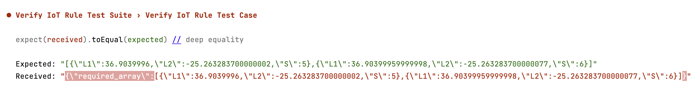

# Tool for Validating AWS IoT Rules

## Description
This project creates a validation framework for IoT Rules SQL Statements. It:
* Does the heavy lifting of creating and configuring the IoT Rules and necessary infrastructure.
* Solves the problem of enabling friction free validation of Rules syntax, payload transformations, etc.
* Provides an easily extensible library of sample SQL statements, with input payloads and expected output.

The goal of this framework is to provide developers with a "Closed-box" - type of validation tool, where only input payload, SQL statement and expected output need to be configured.
If the Rules Engine parses the input as expected with the expected output, tests will succeed, if not they will fail.
Expected versus actual output payload will be printed for references.

This project comes with a library to test cases located in `verification-tool-for-aws-iot-rules/test/testdata`
The test suite will run through each of the test cases there.

If there is a test failure, you will see the comparison between expected and actual output (as below).

## Pre-requisites
- You need to have an AWS Account and your set-up must export the needed AWS access key and session token.
- You need to have node installed. This project was tested with Node v18.16.0.
- Make sure you add your AWS account id in the configuration file: `config.js`. This is used to create a least privilege device policy.

## Getting started
1. Clone the repo
2. Run `npm install`
3. To run the test, run `npm run test`

By default, the default validation scenario is executed: [casting-sensor-payload.json](util/config.js).
To change the default scenario, got to [config.js](util/config.js), and re-set the `defaultInputFile` to a file of your choice from the provided files in the [validation/validation-data](validation/validation-data) directory.

You can choose the validation scenario you want to execute, by running:

```npm test -- -inputFile=<existing or new file name>```

You can also choose to execute all the provides scenarios, by running:

```npm test -- -inputFile=ALL```

## Adding a new test case
To add a new test case, you need to add a new JSON file in the `verification-tool-for-aws-iot-rules/validation/validation-data` folder.

The contents of the file should have the following structure:

`{
"topic": "test/",
"inputPayload": {"messages":[{"message": "a"}, {"message": "b"}]},
"inputSql": "SELECT VALUE *.messages FROM 'test/'",
"expectedOutput": [{"message": "a"}, {"message": "b"}]
}`

The JSON keys are mandatory fields, and the values must be built according to your test scenario.
You need to make sure that the topic name is test uses is unique.
This is because Jest runs the tests in parallel, and we are using one single MQTT connect and one device for all tests.

The JSON schema for the file object structure is [here](https://gitlab.aws.dev/dimaalin/verification-tool-for-aws-iot-rules/test/input-json-schema.json).

If you add more validation scenarios, please bear in mind that you might need to adjust the Jest timeout value.
If you want to execute all validation scenarios together in the same test suite after you add more scenarios, you should adjust the timeout value in the test itself, or in the [jest.config.js](jest.config.js).

## IMPROVEMENTS
There are improvements needed to this tool:
1. In the current version, this tool is designed to run locally. Ideally it would be integrated in a CI/CD pipeline.
3. Add support for MQTT 5 and Protobuf.
4. In the current version, the tool assumes that the rule will execute (i.e. that the payload satisfies the WHERE clause). To validate scenarios where input payloads do not satisfy the WHERE clause, a new test case needs to be created, with modified expectations.
4. Improve overall resilience.
5. Improve execution time.

## Security

See [CONTRIBUTING](CONTRIBUTING.md#security-issue-notifications) for more information.

## License

This project is licensed under the Apache-2.0 License.

